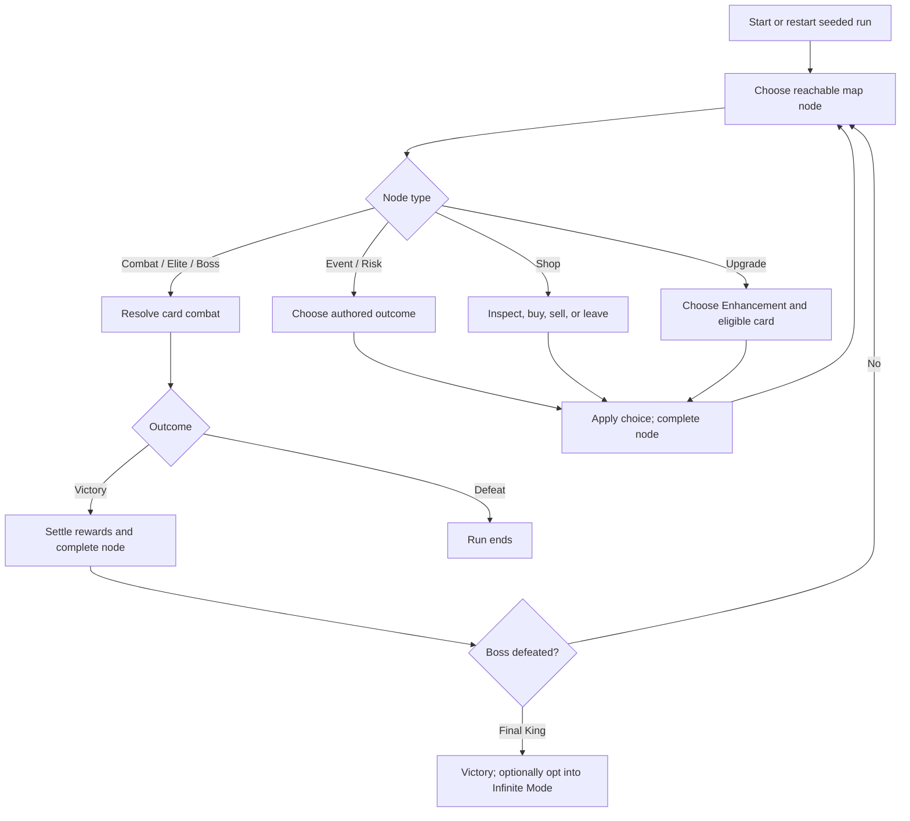

# CardPG — Game Design Document

> **Portfolio design brief | Unity prototype | Research snapshot: October 9, 2026**  
> This document describes the current project as evidenced by runtime code, authored Unity content, tests, and development notes. Status labels matter: **Implemented / tested** means supported by current code and focused automated or recorded integration evidence; it does not imply human playtest acceptance. **Implemented / acceptance pending** is working prototype content whose phase has not received owner sign-off. **Planned / draft** is not a current rule.

## 1. Game Overview

**Genre:** Single-player, turn-based roguelike card battler with run-based deck and build progression.

**Concept:** CardPG turns a familiar playing-card deck into both the player's combat vocabulary and progression track. The player spends cards to attack, defends by committing cards against enemy attacks, and reshapes a run through persistent Artifacts, per-card Enhancements, consumables, events, and route choices. A standard run has twelve major maps, each concluding in a face-card boss: four Jacks, four Queens, then four Kings. Beating a boss adds that exact rank-and-suit card to the run's collection.

**Inspirations:** Regicide informs the suit-and-rank card combat foundation; Balatro informs the appeal of rule-changing items, synergies, and run-specific builds. CardPG retains its own tactical decisions: cards are also defense resources, attack actions are usually single-card, and long-term progression changes how particular cards or actions behave.

**Player experience goal:** Make each card commitment consequential. The player weighs immediate damage against future hand value, then uses route and reward choices to form a build from limited resources. Seeded runs support repeatable attempts and debugging; they do not prove balance or replay value.

**Design pillars**
1. **Cards are tactical resources.** Playing or blocking with a card changes both the current encounter and the remaining hand/deck.
2. **Builds change rules, not just numbers.** Artifacts and Enhancements add conditional effects, suit synergies, and limited alternate action patterns.
3. **Readable risk and recovery.** Telegraphs, pending attacks, route types, and resource costs should support deliberate choices; HP persists between encounters.
4. **Run identity with deterministic replay.** Boss order, route/content, shops, and combat randomness are seeded through separate streams so a seed can reproduce a run without one subsystem perturbing another.

## 2. Core Gameplay Loop

### Encounter loop
At encounter entry, the game initializes the enemy group, attempts to add one card to the hand (it does not refill the hand), applies encounter-start effects, and presents the player phase. The player selects a legal card action against a specific enemy, or prepares defense when enemies attack. A successful enemy defeat draws one card; enemy Gold is secured and paid when the encounter is won. Victory resolves the node and opens route progression; defeat ends the run. Player HP persists across encounters.

The standard hand limit is eight, with Artifact rules able to modify it. There is no automatic per-turn draw. If the hand is empty during the player phase, **Recover** takes one aggregate current-enemy attack as combat damage and, if the player survives, requests one draw; it does not create a second retaliation. A player may also explicitly accept remaining incoming damage with **Take Damage**.

### Map progression loop
Each map offers a deterministic branching route of five columns × three nodes, then a boss. Links go forward through same-row and seeded diagonal connections. Nodes include Combat, Elite, Shop, Event, Upgrade, Risk, and Boss. Combat/Elite labels hide enemy identity until entry; some Event/Risk information is hidden. A node completes only after successful resolution.

Route types trade off rewards against HP, hand resources, Gold, capacity, and uncertainty: Combat/Elite offer Gold and kill draws; Shops sell build options; Events/Risks exchange resources; Upgrades offer a free Enhancement for an eligible card.

The first map excludes Shops from its first two route depths; the first two maps exclude Elite nodes. These onboarding constraints do not guarantee an affordable Shop on later routes.

**Run boundaries:** the standard run ends after the twelfth King, with the final face-card reward granted before completion. The result screen supports same-seed retry, a new run, or return to menu. Infinite Mode is an opt-in continuation after Map 12; it is implemented but awaiting owner phase acceptance.

## 3. Combat Design

### Cards, suits, ranks, hand management
The starting collection is exactly 40 cards: Ace through Ten in each of Hearts, Diamonds, Clubs, and Spades. It contains no face cards. Card attack values are Ace 1, numbered cards at face value, Jack 10, Queen 15, King 20. Suits do not provide baseline powers; suit effects come from Artifacts or other authored rules. The hand cap starts at eight. Runtime card identity and authoritative Deck, Hand, Discard, and Owned zones prevent visual layout from determining card ownership.

Normal combat commits one card. The narrow exception is **Ace Pairing**: exactly two cards may be played together if at least one is an Ace, including Ace + Ace. Both cards are discarded atomically, their independently modified attack values are summed, and they constitute one player action against one selected enemy. General poker-hand combat is not a baseline feature. Artifact-gated same-rank actions are a further limited build rule, not general poker.

### Attack, defense, criticals
Enemy survivors create distinct pending attacks for defense assignment. Each defense card must fully cover one distinct attack; over-block is not carried to another enemy. Where an enemy imposes a full-coverage rule, partial coverage is invalid for that attack. A deterministic matching policy can assign cards to eligible attacks. Remaining enemy attacks, once accepted, resolve as one aggregate incoming damage hit; this preserves a single player Shield interaction for that aggregate.

Card attacks use card-local and Artifact/Enhancement modifiers; documented order is base plus card-local flats, multipliers, then Artifact flats, followed by action-level rules/caps at their defined stages. Preview and execution share a calculation path. One Shield charge blocks one positive resolved combat hit. Multi-hit effects resolve per hit; lethal hits stop later hits on that target. Card consumption and once-per-action effects remain singular.

The configurable default critical chance is 25%. Ace pairs are eligible for one seeded action-level critical roll; on success, damage doubles and an Ace may return to hand if capacity permits. Critical chance can be changed by authored build rules (for example, Ace Emblem's 50% override on an Ace-containing action) or by Lethal Enhancement. A critical applies after the action's damage cap. Single cards do not crit solely because a default chance exists; they require an effect that makes them eligible. Royal Family is another Artifact-gated rule: a same-suit Ten, Jack, Queen, King, and Ace set can instantly defeat its target under its authored rule.

### Effects and encounter outcomes
Effects include damage modification, block, healing, draw, Gold, counters, extra turns, enemy abilities, and run-local progression. Their exact order and conditions are authored and resolved at action/encounter boundaries. HP healing is clamped to maximum and can be denied by Withering. Direct Run/Event HP costs are not combat hits and do not consume Shield. Combat has Victory and Defeat terminal outcomes; fleeing is distinct from death and does not grant a kill draw or defeated-enemy Gold.

## 4. Progression & Run Structure

A seeded boss sequence contains four suits at each rank in grouped order: Jack maps 1–4, Queen 5–8, King 9–12; suit order is shuffled within each rank group. The matching defeated boss awards its exact face card. Boss rewards join the shuffled draw deck, so they expand the collection but are not guaranteed to appear immediately in the hand.

Normal encounters may include groups (including three Goblins); each enemy is independently targetable and surviving enemies contribute attacks. Elites are optional route challenges with their own authored abilities and rewards. Bosses use suit-specific prototype traits and can carry compatible abilities. Do not substitute the workbook's draft boss-ability list for the active traits: those rows remain draft status. The current roster includes authored enemies such as Goblin, Knight, Shieldbearer, Brute, Duelist, War Drummer, Goblin Captain, Royal Knight, Thief, and Master Thief. Enemy and boss values are prototype balance, not a validated final curve.

Events offer authored trade-offs across HP, Gold, card draw, Enhancements, or route information. Upgrade nodes make deterministic free Enhancement choices; the player chooses an eligible owned card when confirming. Shops cache offers and prices, separate inspect/select from Buy, and revalidate ownership, eligibility, and affordability on confirmation. Later content such as Contracts and Blood Ritual is present in code/content but remains in the workbook/development notes as awaiting phase acceptance; it is described as current prototype functionality only with that qualification.

## 5. Card Customization & Build Variety

**Artifacts** are run-long build modifiers, not card upgrades. They support offense, defense, suits, hand/draw behavior, economy, consumables, and route/growth effects. Examples of accepted prototype rules include Club damage multiplication, Heart healing, Diamond draw, Spade block synergy, attack/block bonuses, counterattacks on successful card blocks, and shop/reward economy effects. Ownership includes a base capacity of five Persistent Artifact slots. Exact duplicate instances can occupy separate slots and can be manually merged when they match definition and tier; upgrade tiers reset to the canonical next-tier instance. These later merge/tier systems are implemented but acceptance remains pending in the relevant development tracker.

**Enhancements** attach to one CardInstance and preserve its stable identity. The baseline rule is one Enhancement per card. Examples include Sharpened (+3 attack), Hardened (+3 block), Mending (2 HP at player-turn start while held), and Quickdraw (draw 1 on play). Other authored Enhancements add conditional damage, Gold, held-card bonuses, multi-hit, or other effects. Upgrade and Shop targeting is explicitly player-selected; some new replacement/target interactions are recent and should be considered in progress until confirmed against the current dirty worktree and accepted.

**Consumables** are limited-use run resources stored in a backpack (three base slots; some Artifacts expand or change capacity). The content includes healing, direct enemy damage, Enhancement application, copying or destroying cards, and suit-changing Runes. Runes can carry multiple charges; the Rare Traveler's Pack can stack identical consumables in a slot. A claim/replace/decline reward tray avoids silently losing a reward when storage is full. These are implemented prototype systems, but the associated later phases remain pending owner acceptance.

Build variety therefore comes from selecting compatible route rewards and items, choosing which exact card to enhance, managing limited Artifact/storage capacity, and deciding when to spend a hand card as offense or defense—not from unrestricted hand combinations.

## 6. Economy & Reward Design

Gold comes from enemy/boss rewards, authored events, and economy effects. Combat encounter Gold is secured until encounter victory; defeat does not pay it. Shops offer a deterministic cached set of Artifacts, Enhancements, consumables, and occasional special services. Offer selection is inspection only; buying is a separate confirmation. Players can sell selected Artifacts/Consumables for half authored price rounded down. Investment, where available, takes a whole-Gold stake and settles at the next Shop with a seeded 50% outcome and 3× payout on success. Guidance costs 5 Gold to reveal a hidden route node. These newer economy features have implementation evidence but remain pending phase acceptance.

Gold competes with immediate recovery, build pieces, and future shop flexibility. Artifact slots impose a separate capacity cost: a powerful Artifact may be unavailable to a full build while an Enhancement can still be purchased. Consumable slot/charge choices add another inventory constraint. Exact prices for some content remain temporary prototype values because workbook prices are blank; they must not be presented as final economy balance.

## 7. Difficulty & Balancing

### Current numeric rules and constraints

| Rule | Current prototype value / constraint |
|---|---|
| Starting deck | 40 cards: four suits × Ace–Ten; no J/Q/K |
| Starting player health | 30 HP, provisional; persists between encounters |
| Base hand cap | 8; Artifact modifiers may change it |
| Encounter draw | Attempts to add 1 card; no automatic per-turn draw |
| Default critical chance | 25% configurable; applies only to eligible actions |
| Standard map structure | 5 route columns × 3 nodes, then boss |
| Boss progression | 12 total; four each Jack, Queen, King |
| Persistent Artifact capacity | 5 base slots |
| Infinite continuation | After Map 12; HP ×1.10 and ATK ×1.04 per added map, floor each step |

Enemy scaling is implemented from map index and then transitions to a separate Infinite scaling rule. In standard progression, documented runtime applies 20% HP and 7% ATK per map index with rounding away from zero; infinite maps compound from Map 12. The first boss has a 20 HP override; the general boss construction has its own baseline. Exact authoring/stat interactions vary by enemy and should be read from current assets rather than inferred from draft workbook rows.

### Balance risks and trade-offs
The finite twelve-boss structure creates a clear run endpoint and staged face-card growth, but boss rewards enter a shuffled deck and may not be immediately accessible. Persistent HP makes small encounter costs accumulate; defense protects HP but consumes cards that could attack. Kill draws can turn a successful elimination into hand recovery, creating a tactical incentive to focus weakened enemies. More complex Artifacts can make effect timing and damage caps difficult to communicate; action-level caps before critical multiplication, per-hit Shield, and once-per-action triggers are important boundaries to test and explain.

**Actual balance work:** development notes report a conservative review retaining the 30 HP baseline, current enemy/boss curve, route cadence, prototype prices, and event values. No meaningful recorded twelve-map human pacing study is available; later feature checks are mostly automated or staged scene interaction. Therefore “retained after a prototype review” must not be represented as externally validated or statistically balanced.

**Proposed work, not approved tuning:** play through representative complete runs, track route/shop affordability and map splits, then change prices, encounter cadence, or stats only from observed evidence. Additional map depths were explicitly deferred rather than accepted as the solution to pacing.

## 8. UI/UX Design Goals

The UI uses a responsive card fan with selection/hover elevation, drag reordering, and visual-only Rank/Suit sorting. The enemy row supports exact targeting. Contextual Play/Block, pending-damage, Take Damage, and empty-hand Recover keep decisions visible. Players can inspect the draw deck and build state. Confirmation should validate and explain failures without spending on selection.

Presentation remains a UI prototype with placeholder enemy portraits and temporary card visuals. Human mouse/drag feel, multiple aspect ratios, and natural full-run pacing are unverified. The October 9, 2026 dirty worktree includes in-progress CardManager/UI/card-view changes and a direct-hand-targeting test; these are not accepted UX. Do not infer player feedback from automated tests.

## 9. Current Development Status

**Implemented and supported by tests/recorded checks:** authoritative card zones and identity; 40-card start; seeded run streams; branching maps; multi-enemy targeting; card defense, Recover, Shield, and damage lifecycle; Ace pairs and criticals; Artifact/Enhancement effects; enemy/boss abilities; shops, events, upgrades, consumables, run results, seed retry, and frontend flow. Development notes report extensive EditMode regressions and focused Game-scene checks at earlier milestones. Those historical counts do not establish that tests were rerun on October 9.

**Implemented; phase/owner acceptance pending:** later expansions documented in the October 2026 tracker include expanded Artifact tiers/content, backpack/reward-tray systems, Blood Ritual, Quest Contracts, and Infinite Mode. Several workbook entries carry “Implemented — awaiting phase acceptance.” Treat their rules as prototype functionality, not final release commitments. The latest October 4 issue pass describes additional selling, Artifact merging, consumable interaction, Block cycling, Double Strike, visual pipelines, and other UI/gameplay changes; its recorded automated full regression was unavailable, so that pass must not be reported as fully automated-test-passed.

**In progress / not verified for this brief:** the October 9 user-owned dirty edits to CardManager and UI/card-view code plus a new direct-hand-targeting EditMode test. Their intended completeness, runtime behavior, and test outcome were not independently established here.

**Planned, draft, or deferred:** workbook-only content and abilities marked Draft; undocumented or placeholder “God” boss definition; unassigned final enemy/Artifact visual assets; human usability tests, broad aspect-ratio validation, meaningful recorded twelve-map balance/pacing study, save/load/metaprogression, and any additional map-depth decision. Some draft workbook entries conflict with current runtime values; runtime plus current authored content is the source of truth.

## 10. Design Rationale

CardPG's defining overlap is combat and resource management: playing a card can prevent damage now but removes that attack from the current hand; attacking leaves other cards available for defense. Persistent HP links encounters, while Recover provides a bounded response to an empty hand rather than a free reset.

Single-card combat keeps card identity, attack value, and suit builds easy to evaluate. Ace Pairing adds a high-variance exception while keeping ordinary selection constrained. Artifacts and Enhancements extend strategy across the run: one changes rules or resource economy; the other invests in a specific card. Routes determine which risks and rewards are pursued, while deterministic seeds support reproducible iteration.

These are observable design properties, not inferred developer motivations. The trade-off is breadth versus clarity: many build hooks can create variety only if triggers, stacking, caps, and feedback remain understandable. Human playtesting is still needed to establish that choices feel fair, legible, and well-paced.

---

**Research boundary:** Sources reviewed include current code and tests under `Assets/Scripts/`, `Assets/Data/`, and `Assets/Tests/`; `CARDPG_DEVELOPMENT.md`; `AGENTS.md`; `CardPG_GameData_organized.xlsx`; and dated implementation trackers in `Locus/knowledge/plan/`. The workbook contains a mixture of implemented, pending-acceptance, draft, and blank rows. Runtime evidence takes precedence for present gameplay.
